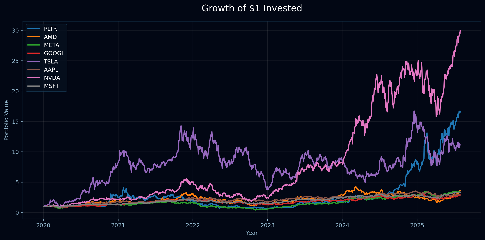
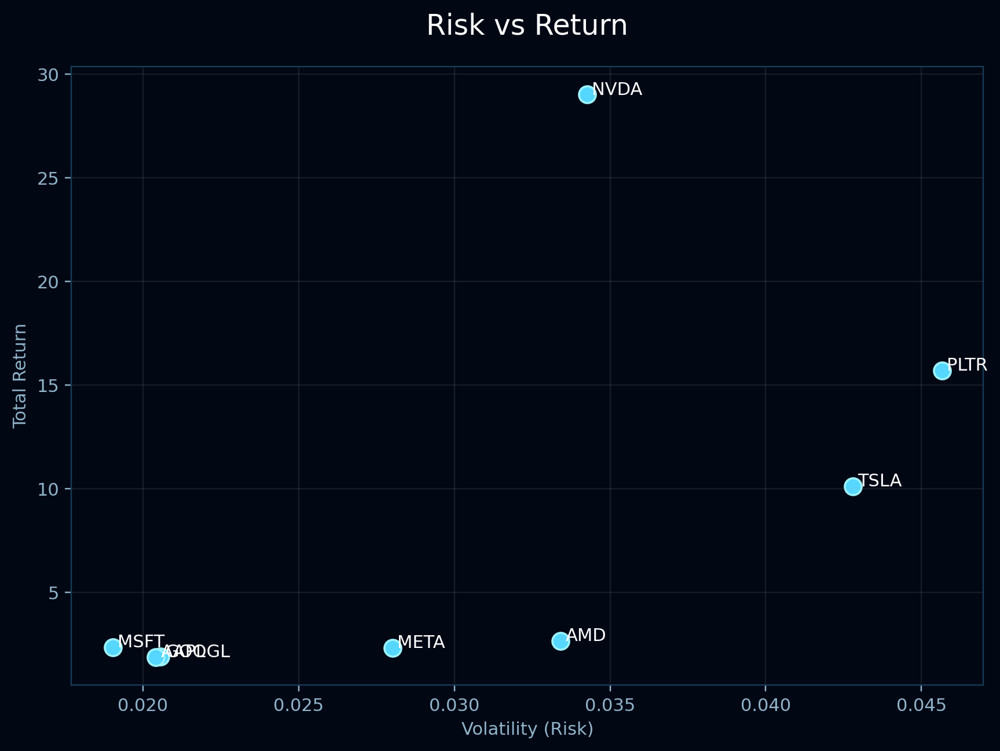
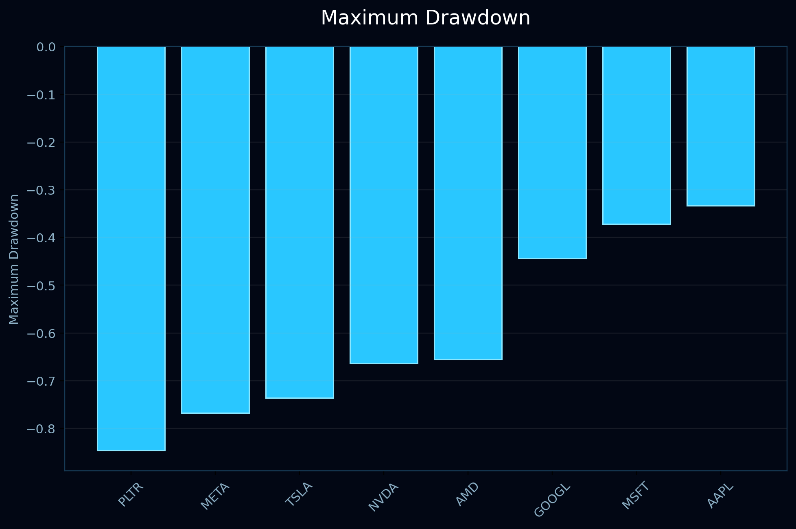

# priced in

### exploring risk, return, and market behavior in technology markets

An interactive data science project analyzing the historical stock performance of eight leading technology companies between **2020 and 2025**.

Using financial data, statistical analysis, and interactive visualization, this project examines how market leaders balance **growth, volatility, and downside risk**. The dashboard transforms historical stock prices into insights about investment performance and risk behavior.

---

## Live Website

**View the interactive dashboard:**

https://seryuiroke.github.io/priced-in/

---

## Research Question

> How do leading AI and technology companies differ in long-term growth, volatility, and investment performance?

---

## Dashboard

### Growth of $1 Invested



### Risk vs Return



### Maximum Drawdown


---

## Key Findings

- NVIDIA produced the highest cumulative return during the study period.
- Microsoft demonstrated the lowest overall volatility.
- Palantir experienced the largest maximum drawdown.
- Higher long-term returns generally coincided with greater investment risk.

---

## Methodology

The analysis consisted of four stages:

1. Data collection
2. Data cleaning and preprocessing
3. Statistical analysis
4. Interactive visualization

Historical closing prices were transformed into daily returns, cumulative returns, volatility measurements, and maximum drawdowns using Python.

---

## Limitations

While this project analyzes historical market behavior, past performance does not guarantee future results. The analysis focuses on a selected group of technology companies and does not represent the entire market. Additionally, stock prices are influenced by external factors such as economic conditions, industry changes, and investor sentiment that are not fully captured through historical price data alone.

---
## Technologies Used

- Python
- pandas
- NumPy
- matplotlib
- Plotly
- HTML
- CSS
- Git
- GitHub

---

## Repository Structure

```text
priced-in/
│
├── data/
│   ├── raw/
│   └── processed/
│
├── notebooks/
│   ├── 01_data_collection.ipynb
│   ├── 02_exploratory_analysis.ipynb
│   ├── 03_risk_and_market_insights.ipynb
│   └── 04_methodology_and_limitations.ipynb
│
├── docs/
│   ├── index.html
│   ├── style.css
│   ├── priced_in_dashboard.png
│   ├── growth_of_1.png
│   ├── risk_vs_return.png
│   └── maximum_drawdown.png
│
└── README.md
```
---

## Future Improvements

Potential extensions of this project include:

- Adding additional financial metrics such as Sharpe ratio, beta, and risk-adjusted returns.
- Comparing technology companies against broader market benchmarks.
- Implementing portfolio optimization simulations.
- Expanding the dashboard with additional interactive filters and analysis tools.

---

## Installation

Clone the repository:

```bash
git clone https://github.com/seryuiroke/priced-in.git
```

Install required libraries:

```bash
pip install pandas numpy matplotlib plotly yfinance
```

Run the notebooks in order to reproduce the analysis.

---

## Author

Shraddha Rao

GitHub:

https://github.com/seryuiroke